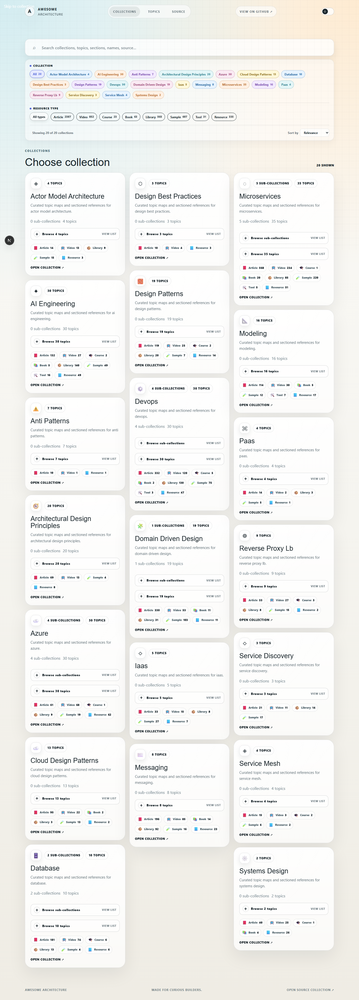

  <h1 align="center">Awesome Architecture</h1>
  
A searchable guide to software architecture patterns, systems, AI engineering, and practical resources.

  

    <a href="https://awesome-architecture.com/">Open the web experience</a>
  

## Explore Awesome Architecture

The repository is the source catalog. The web app turns it into a reader-friendly experience with searchable collections, clickable subcollections, topic pages, resource-type filters, and direct links to every reference.

  

Use the [Awesome Architecture web app](https://awesome-architecture.com/) for fast browsing. Use the table below for a lightweight map of the catalog.

## Catalog Map

The web app organizes every topic into seven compact collections:

| Collection                                           | Scope                                                             |
| ---------------------------------------------------- | ----------------------------------------------------------------- |
| [AI Engineering](docs/ai/)                           | Agents, models, RAG, MCP, and AI tooling                          |
| [Foundations](docs/foundations/)                     | Architecture fundamentals, principles, modeling, and code quality |
| [Software Architecture](docs/software-architecture/) | Architecture patterns, application styles, and anti-patterns      |
| [Distributed Systems](docs/distributed-systems/)     | Microservices, messaging, reliability, and scaling                |
| [Data](docs/data/)                                   | Databases, caching, IDs, and data design                          |
| [Cloud Platforms](docs/cloud-platforms/)             | Azure, cloud patterns, infrastructure, serverless, and networking |
| [DevOps](docs/devops/)                               | CI/CD, containers, Kubernetes, and developer operations           |

Topic pages are discovered from folders automatically, so new topics do not require manual navigation updates.

## Browse Resources

The catalog includes articles, videos, courses, books, libraries, samples, tools, and other references. Search the [web app](https://awesome-architecture.com/) by collection, topic, section, name or source domain, or browse the full source tree in [`docs/`](docs/).

## 🙏 Special Thanks

Thanks to the authors of the links for their valuable content. This project gathers them in one place so architecture topics are easier to find and study.

## ⭐ Support

If you like the project, feel free to star the repository. It helps the collection reach more builders.

## 🤝 Contribution

Contributions are always welcome. Please read the [contribution guidelines](contributing.md) first.

Thanks to all [contributors](https://github.com/mehdihadeli/awesome-software-architecture/graphs/contributors). The goal is to build a categorized, community-driven collection of practical architecture resources.

